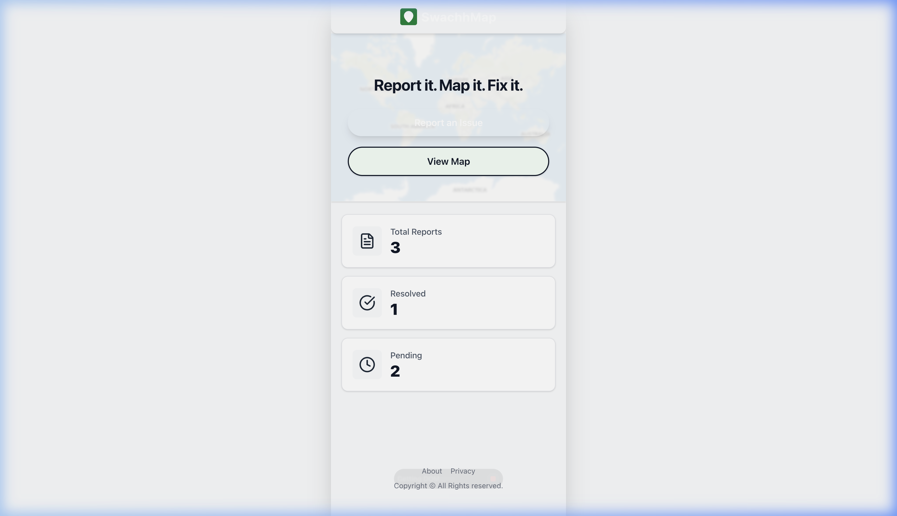
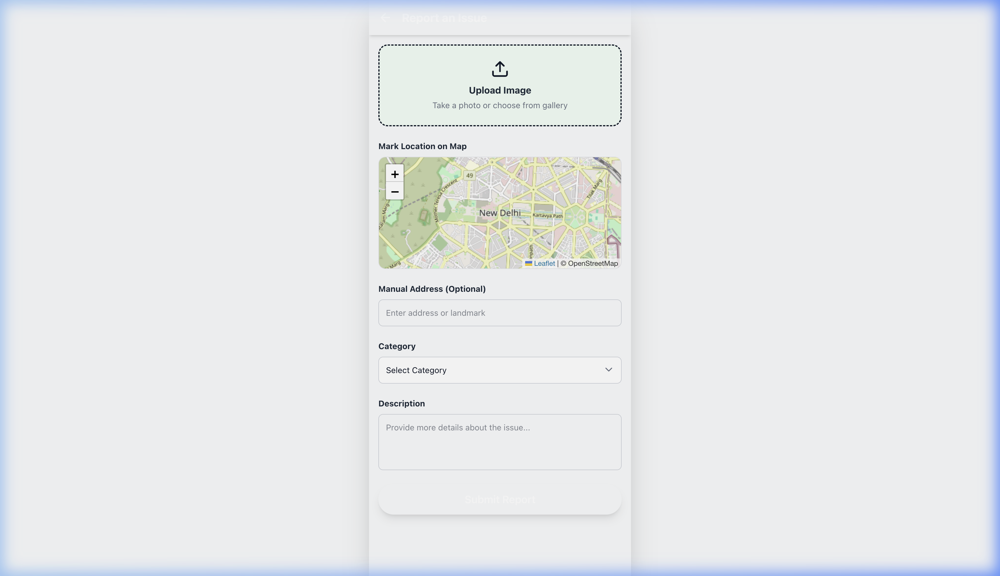
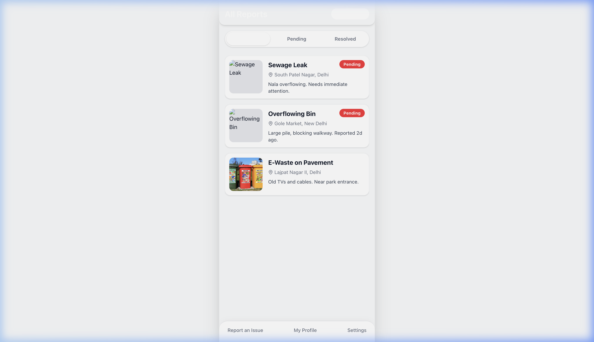

# 🌿 SwachhMap

**"Report it. Map it. Fix it."**

SwachhMap is a community-driven platform designed to empower citizens to report waste issues, visualize them on an interactive map, and track their resolution through a transparent "Before & After" system. Built with a focus on ease of use and high visual fidelity, SwachhMap simplifies the process of keeping our communities clean.

---

## 📸 Overview

<div align="center">
  
  
  
</div>

---

## ✨ Key Features

- **📍 Interactive Mapping**: Pin-drop waste issues using an integrated Leaflet.js map. Visualize pending and resolved tasks across your city with real-time markers.
- **🚀 Smart Priority Auto-Tagging**: Our intelligent algorithm scans report descriptions for keywords like "hospital", "market", and "sewage" to automatically assign emergency priority levels.
- **🖼️ Before & After Transparency**: Reports can only be marked as 'Resolved' by uploading a secondary "After" image, creating a clear audit trail of impact.
- **🏆 Community Points System**: Earn **+10 points** for reporting an issue and **+50 points** for successfully resolving one.
- **🗺️ Direct Navigation**: A single click on any report routes you directly to the exact coordinates using Google Maps directions.

---

## 🛠️ Technology Stack

- **Frontend**: [React.js](https://reactjs.org/) + [Vite](https://vitejs.dev/)
- **Styling**: [Tailwind CSS](https://tailwindcss.com/) (v4)
- **Mapping**: [Leaflet.js](https://leafletjs.com/) with OpenStreetMap
- **Icons**: [Lucide React](https://lucide.dev/)
- **Data Layer**: Mock Firebase Interface (Ready for live Firestore/Storage migration)

---

## 🚀 Getting Started

### Prerequisites
- Node.js (v18+)
- npm or yarn

### Installation
1. Clone the repository:
   ```bash
   git clone https://github.com/JayantOlhyan/SwachhMap.git
   cd SwachhMap
   ```
2. Install dependencies:
   ```bash
   npm install
   ```
3. Run the development server:
   ```bash
   npm run dev
   ```

---

## 🗺️ Data Model

SwachhMap uses a structured NoSQL schema for scalability:
- `id`: Unique identifier (UUID).
- `category`: Garbage, Sewage, Pothole, etc.
- `priority`: High, Medium, or Low (Auto-calculated).
- `status`: Pending or Resolved.
- `location`: Coordinates (lat, lng) and human-readable address.
- `images`: URLs for both 'Before' and 'After' states.

---

## 🛤️ Future Roadmap

- [ ] **Live Firebase Integration**: Transition from mock state to live Firestore & Auth.
- [ ] **Leaderboard**: Global community rankings based on points earned.
- [ ] **AI Image Verification**: Auto-confirm if an "After" image actually reflects a cleaned area.
- [ ] **Push Notifications**: Notify users when a reported issue near them is resolved.

---

## 🤝 Contributing

Contributions are what make the open-source community such an amazing place to learn, inspire, and create. Any contributions you make are **greatly appreciated**.

---

## 📄 License

Distributed under the MIT License. See `LICENSE` for more information.

---

<p align="center">Made with ❤️ for a cleaner world.</p>
